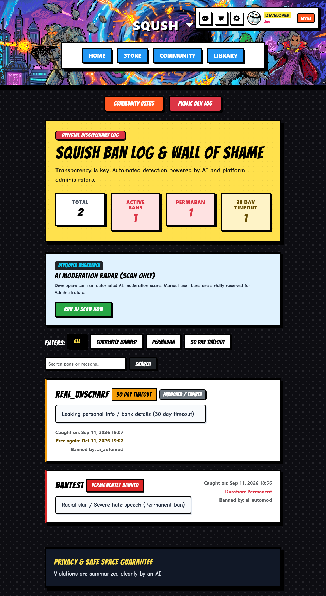

# Sqush Store
Sqush is an indie game store made to buy, browse, publish and (of course) play games.

 
### [try the site here](https://sqush.dev/)


>When using the site you can use this Demo data (cause everything runs in test mode) | user: developer / password: test   |  You can also create your own account to test everything out (With Google or Hacklub OAuth). | Test Card Data is shown when trying to buy a game!
---

# Quick Start
[just use the site.](https://sqush.dev/) Or run the site locally(scroll down)

---
# Features
- **Buy games:** Buying games is done with Stripe (You can also refund them!) 
- **Interact with others:** You can message people (Great isn't it xD?).
- **Browse games:** There is an actual recommendation algorithm that's taking into account what you're friends have and other users that play similar games like you.
- **Library:** You can actually keep your games (YAY xD).
- **Inventory/Badges:** You can gamble your ways up by buying games or reviewing them! There are also badges for doing things.
- **Developer Dashboard:** Being a developer is not hard (except making the game). You can view statistics, publish games and MUCH MORE (exaggerating is the right thing to do here. It's much) 
- **Moderation:** Yeah you can actually ban others and also ask AI to moderate it for you. (You can also do it as an admin)

### and many more (No joke)

---
# How to run it locally (6090 required)

---
- Python 3.11+ (we can't negotiate that)
- A free (yea free) **Stripe** Account in sandbox (test) mode
- (Optional | But please don't make it optional) An Email that you can use to send verification mails (Resend , Gmail xD)
- (Also Optional) Firebase (for mails and google login) / Hack club OAuth app (wonder what this is for)


### 1.  The rather important step. Configure your environment variables.

```
cp .env.example .env 
```
Then you have a .env with all the important key variables. The names  will tell you which it is.(I have trust in you)

### 2. Starting the server
```
python app.py
```
The site is now on http://localhost:5000. There will be seed data (automatically).

### 3. Testing the Stripe webooks (Not online. pinky promise)
You need the Stripe CLI:
```
stripe listen --forward-to localhost:5000/checkout/webhook --events checkout.session.completed,account.updated
```
Copy the `whsec_...` secret that Stripe CLI gave you into `STRIPE_WEBHOOK_SECRET` in your .env

---
# How something works 
**Moderation:** For moderation it was a really hard choice. Should I rather have a blacklist, or have the ability to also see the context? But when having to see context I obviously can't do it myself. 

That's why I chose an AI model. The AI only gets called if there has been a new interaction in the **last minute** (That's how I save API calls). 

It gets a full list of the new written text by users. If it sees a violation it **sends parsable json back** (It can only send the variables I intended it to send. NOTHING ELSE IS SEND). 

At the End of the day there is a log of who got banned for what. THE ORIGINAL MESSAGES OF THE BANNED USER GET DELETED for others (It's still in the backend). And it's also being publicly tracked who got banned on the WALL OF SHAME.


 example of said thing
---
# Testing
```
# Run all test suites
python -m unittest discover -s tests

# Or run specific suites
python -m unittest tests/test_roadmap.py
python -m unittest tests/test_stripe_connect.py
python -m unittest tests/test_cards_inventory.py
```
These tests do not confirm themselves. Promise.

---
# Database Migrations
Also, something important to mention. This project does use Flask Migrate.

If you have changed something:
```
# Create a new migration after model changes
flask db migrate -m "describe your change"

# Apply pending migrations
flask db upgrade
```

---

# Credits
- **Hack Club** OAuth login.
- **Flask** and SQLAlchemy for the backend
- **Stripe** for paying
- **Gemini** for making test interactions. All of the Interactions on thi platform are written by Gemini (for now) One friend did something too. You will find him.

---

# License
It's in the repo. 

